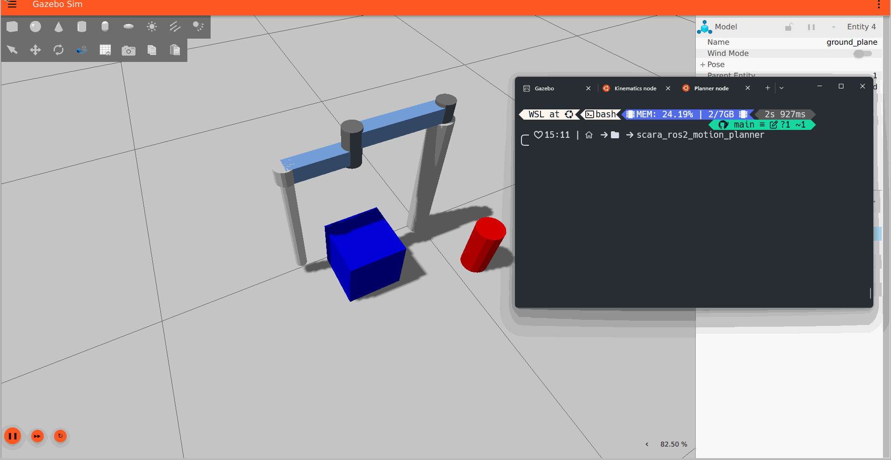

# SCARA Robot Motion Planning (ROS 2 / Gazebo)


This project demonstrates the implementation of classic motion planning algorithms for a SCARA manipulator simulated in ROS 2 and Gazebo.

The primary goal is to implement and visualize algorithms like **Potential Fields** and **RRT (Rapidly-exploring Random Tree)**, creating a modular control architecture that integrates motion planning and control.


Potential field implementation


RRT* Implementation




## 🚀 Features

* **Realistic Simulation:** A SCARA (RRRP) robot simulated in Gazebo with joint controllers.
* **`ros2_control` Integration:** Full integration with `ros2_control` for real-time trajectory control.
* **Dedicated Kinematics Node:** A (`kinematics_node`) that solves Inverse (IK) and Forward (FK) Kinematics, accepting targets in Cartesian coordinates (`geometry_msgs/Pose`).
* **Potential Fields Planner:** A (`potential_field_planning_node`) that guides the robot to a goal while actively avoiding pre-defined obstacles.
* **RRT* Planner:** Implementation of the RRT-Star algorithm to find paths in complex obstacle environments.

## 🏗️ System Architecture

This project uses a decoupled "Brain" and "Executor" architecture:

1.  **The Brain (Planner):**
    The `potential_field_planning_node` or `RRTstar_planning_node` decides where the robot *should* go. It calculates safe, incremental steps and publishes them to a topic.
2.  **The Executor (Kinematics):**
    The `kinematics_node` listens for commands from the "Brain." It has no knowledge of obstacles. Its sole task is to receive a target pose (X,Y,Z) and calculate the necessary joint angles (Inverse Kinematics) to move the robot there.


## 🛠️ Installation
1. Clone the repository into your ROS 2 workspace:
```bash
    cd ~/ros2_ws/src
    git clone  https://github.com/nivuciis/scara_ros2_motion_planner 
```
2. Build the workspace:
```bash
    cd ~/ros2_ws
    colcon build --symlink-install
```
3. Source the workspace:
```bash
    source ~/ros2_ws/install/setup.bash
```

## 📂 Directory Structure
Inside the `src/` folder, you will typically find:

`description/urdf/`: Contains the robot's model definition using URDF and Xacro files.

`launch/`: Stores Python launch files used to start the simulation and various nodes.

`scara_robot_simulation/scripts/`: This is where the core Python code for your ROS nodes resides (kinematics, potential fields, RRT*).

`worlds/`: Contains the Gazebo world definitions (.world files), including your environment with obstacles.

## ▶️ How to Use
To run the full simulation, you will need 3 terminals.
In each terminal, first source your workspace:
```bash
source ~/ros2_ws/install/setup.bash
```
1. **Terminal 1**: Launch Simulation (Gazebo)
```bash
ros2 launch scara_robot_simulation scara_simulation.launch.py
```
2. **Terminal 2**: Launch Executor (Kinematics Node)
```bash
ros2 run scara_robot_simulation kinematics_node
```
* You will see the "Kinematics Node... has started." and "Action server connected!" messages.

3. **Terminal 3**: Launch Planner
```bash
ros2 run scara_robot_simulation potential_field_planning_node
``` 

**Observation**: If you only want to test the IK (Inverse Kinematics) Executor without the planning node, follow Steps 1 and 2, and in Terminal 3, send a single pose command:
```bash
ros2 topic pub --once /scara/target_pose geometry_msgs/msg/Pose "{position: {x: 0.5, y: 0.0, z: 0.1}}"
```

## 🧑‍💻 Authors and Credits
* Maintainer/Lead Developer: Vinicius Carvalho ([vrmc@ic.ufal.br](https://github.com/nivuciis))
* Acknowledgements: Paulo Roberto ([prms@ic.ufal.br](https://github.com/wkhadgar)) for providing the base simulation package and developing the kinematics node.
