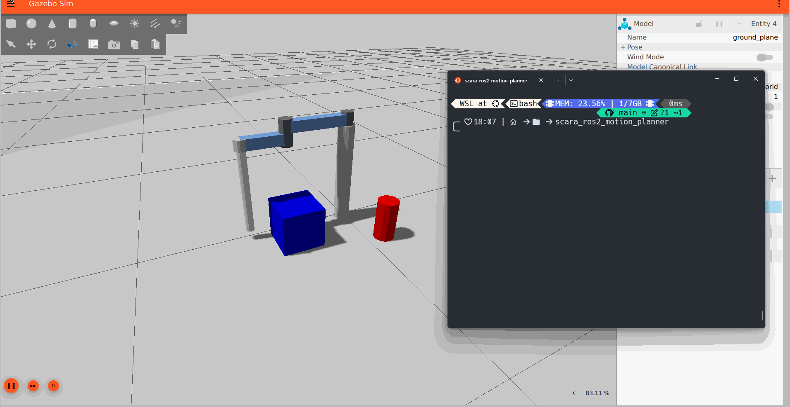

# SCARA Robot Motion Planning (ROS 2 / Gazebo)

This project demonstrates the implementation of classic motion planning algorithms for a SCARA manipulator simulated in ROS 2 and Gazebo.

The primary goal is to implement and visualize algorithms like **Potential Fields** and **RRT (Rapidly-exploring Random Tree)**, creating a modular control architecture that integrates motion planning and control.

## 🚀 Features

* **Realistic Simulation:** A SCARA (RRRP) robot simulated in Gazebo with joint controllers.
* **`ros2_control` Integration:** Full integration with `ros2_control` for real-time trajectory control.
* **Dedicated Kinematics Node:** A (`kinematics_node`) that solves Inverse (IK) and Forward (FK) Kinematics, accepting targets in Cartesian coordinates (`geometry_msgs/Pose`).
* **Potential Fields Planner:** A (`potential_field_planning_node`) that guides the robot to a goal while actively avoiding pre-defined obstacles.
* **(Upcoming) RRT Planner:** Implementation of the RRT algorithm to find paths in complex obstacle environments.

## 🏗️ System Architecture

This project uses a decoupled "Brain" and "Executor" architecture:

1.  **The Brain (Planner):**
    The `potential_field_planning_node` (or the future RRT node) decides where the robot *should* go. It calculates safe, incremental steps and publishes them to a topic.
2.  **The Executor (Kinematics):**
    The `kinematics_node` listens for commands from the "Brain." It has no knowledge of obstacles. Its sole task is to receive a target pose (X,Y,Z) and calculate the necessary joint angles (IK) to move the robot there.

